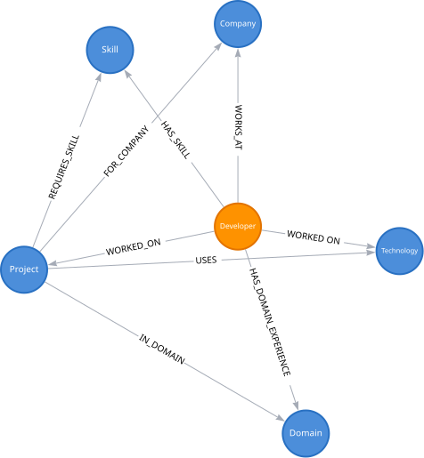

# DevGraph

> Discover developers through their skills, projects, technologies, companies, and professional connections.

**[Live Demo](https://devgraph-ui.onrender.com/)** 

<!-- 
· **[Demo Video](YOUR_RECORDING_URL)**

 -->

---

## What is DevGraph?

DevGraph is a graph-powered developer discovery application built with CognoDB.

Users can search for developers using natural-looking queries such as:

> **Find Rust developers with PostgreSQL experience in fintech**

The application resolves known skills, technologies, projects, companies, and domains from the graph, then uses parameterized Cypher queries to traverse the relationships and return matching developers.

Users can then open a developer profile and explore their projects, technologies, skills, domain experience, and connections to other developers.

---

## Why a Graph Database?

The important questions in DevGraph are about **relationships**, not only individual records.

For example:

```text
Developer
   ├── HAS_SKILL ──────────────> Skill
   │
   └── WORKED_ON ──────────────> Project
                                   ├── USES ──────────────> Technology
                                   ├── REQUIRES_SKILL ────> Skill
                                   ├── IN_DOMAIN ─────────> Domain
                                   └── FOR_COMPANY ───────> Company
```

A question such as:

> Find developers with Rust and PostgreSQL experience who worked on Fintech projects.

requires traversing multiple relationships.

A relational database can represent this data, but relationship-heavy questions become increasingly join-oriented as the number of relationships and traversal hops grows. In DevGraph, those relationships are first-class graph structures, so the query can follow the paths directly.

Another example is discovering developers who worked on the same project:

```text
Developer
   ↓ WORKED_ON
Project
   ↑ WORKED_ON
Developer
```

This connection does not need a separate artificial `CONNECTED_TO` relationship. It can be derived by traversing the existing graph.

---

## Product

### Search


Search the developer network using natural-looking queries.

### Search Results


Results show matching developers together with the graph criteria used for the search.

### Developer Profile


A developer profile exposes connected skills, projects, technologies, required skills, domains, companies, and shared-project connections.

---

## How It Works

```text
User
  │
  ▼
React Search UI
  │
  │ POST /api/search
  ▼
Fastify Route
  │
  ▼
Search Service
  │
  ▼
Entity Resolver
  │
  │ Structured search filters
  ▼
Developer Repository
  │
  │ Parameterized Cypher
  ▼
Neo4j JavaScript Driver
  │
  │ Bolt
  ▼
CognoDB
  │
  ▼
Developer Results
  │
  ▼
React UI
```

The frontend sends the user's search text to the backend. The backend resolves known graph entities into structured filters, then executes fixed Cypher queries with parameters.

User input is never concatenated directly into Cypher.

---

## Graph Data Model



### Nodes

```text
Developer
Project
Skill
Technology
Company
Domain
```

### Relationships

```text
Developer ──HAS_SKILL──────────────> Skill
Developer ──WORKED_ON──────────────> Project
Developer ──WORKS_AT───────────────> Company
Developer ──HAS_DOMAIN_EXPERIENCE──> Domain

Project ──USES─────────────────────> Technology
Project ──REQUIRES_SKILL───────────> Skill
Project ──IN_DOMAIN────────────────> Domain
Project ──FOR_COMPANY──────────────> Company
```

### Example node properties

```text
Developer
  id
  name
  title
  location
  yearsExperience

Project
  id
  name
  description

Skill
  id
  name
  category

Technology
  id
  name
  category

Company
  id
  name
  industry

Domain
  id
  name
```

---

## Key Graph Queries

### 1. Developer search

The main search can combine optional graph filters:

```text
skills
technologies
domains
projects
companies
```

The query traverses:

```text
Developer
   ├── HAS_SKILL ──> Skill
   │
   └── WORKED_ON ──> Project
                         ├── USES ──────> Technology
                         ├── IN_DOMAIN ─> Domain
                         └── FOR_COMPANY > Company
```

### 2. Multi-hop search

Example:

```text
Developer
   ↓ WORKED_ON
Project
   ↓ IN_DOMAIN
Domain
```

This supports searches such as:

> Rust developers with Fintech project experience.

### 3. Technology traversal

```text
Developer
   ↓ WORKED_ON
Project
   ↓ USES
Technology
```

For example:

> Find developers with Axum experience.

### 4. Shared-project connections

```text
Developer
   ↓ WORKED_ON
Project
   ↑ WORKED_ON
Developer
```

This allows the application to discover developers who worked on the same projects.

### 5. Project exploration

A developer's project can be explored through additional relationships:

```text
Project
   ├── USES ──────────────> Technology
   ├── REQUIRES_SKILL ────> Skill
   ├── IN_DOMAIN ─────────> Domain
   └── FOR_COMPANY ───────> Company
```

---

## Parameterized Cypher

All user-derived values are passed separately as query parameters through the official Neo4j JavaScript driver.

Example:

```cypher
MATCH (d:Developer)

OPTIONAL MATCH (d)-[:HAS_SKILL]->(skill:Skill)
OPTIONAL MATCH (d)-[:WORKED_ON]->(project:Project)
OPTIONAL MATCH (project)-[:USES]->(technology:Technology)
OPTIONAL MATCH (project)-[:IN_DOMAIN]->(domain:Domain)
OPTIONAL MATCH (project)-[:FOR_COMPANY]->(company:Company)

WITH
  d,
  collect(DISTINCT skill.name) AS developerSkills,
  collect(DISTINCT project.name) AS projectNames,
  collect(DISTINCT technology.name) AS technologyNames,
  collect(DISTINCT domain.name) AS domainNames,
  collect(DISTINCT company.name) AS companyNames

WHERE
  (
    size($skills) = 0
    OR all(skill IN $skills WHERE skill IN developerSkills)
  )
  AND
  (
    size($technologies) = 0
    OR all(technology IN $technologies WHERE technology IN technologyNames)
  )
  AND
  (
    size($domains) = 0
    OR any(domain IN $domains WHERE domain IN domainNames)
  )
  AND
  (
    size($projects) = 0
    OR any(project IN $projects WHERE project IN projectNames)
  )
  AND
  (
    size($companies) = 0
    OR any(company IN $companies WHERE company IN companyNames)
  )

RETURN
  d.id AS id,
  d.name AS name,
  d.title AS title,
  d.location AS location,
  d.yearsExperience AS yearsExperience
```

Parameters are supplied independently:

```ts
session.run(query, {
  skills,
  technologies,
  domains,
  projects,
  companies,
});
```

This keeps the Cypher structure separate from user data.

---

## Tech Stack

### Frontend

* React
* TypeScript
* Vite
* CSS

### Backend

* Node.js
* TypeScript
* Fastify

### Database

* CognoDB
* openCypher
* Bolt
* Official Neo4j JavaScript driver

---

## Architecture

The backend follows a simple layered structure:

```text
HTTP Route
    ↓
Service
    ↓
Repository
    ↓
Neo4j Driver
    ↓
CognoDB
```

### Configuration

Environment-specific settings are loaded from environment variables.

### Error handling

Database and API failures are caught by the backend and returned as user-safe responses. The frontend displays dedicated error states instead of exposing internal database errors.

### Why the layering?

* **Routes** handle HTTP concerns.
* **Services** coordinate application logic.
* **Repositories** own Cypher and database operations.
* **Database layer** owns the Neo4j driver connection.
* **Configuration** owns environment variables and startup validation.

---

## Project Structure

```text
devgraph/
├── docs/
│   ├── graph-model.png
│   └── screenshots/
│       ├── search.png
│       ├── results.png
│       └── developer-profile.png
│
├── backend/
│   ├── scripts/
│   │   ├── seed.ts
│   │   └── test-search.ts
│   │
│   ├── src/
│   │   ├── config/
│   │   │   └── env.ts
│   │   ├── db/
│   │   │   └── neo4j.ts
│   │   ├── repositories/
│   │   │   └── developer.repository.ts
│   │   ├── routes/
│   │   │   ├── search.ts
│   │   │   └── developers.ts
│   │   ├── services/
│   │   │   └── search.service.ts
│   │   ├── utils/
│   │   │   └── entity-resolver.ts
│   │   └── server.ts
│   │
│   ├── .env.example
│   ├── package.json
│   └── tsconfig.json
│
├── frontend/
│   ├── src/
│   │   ├── api/
│   │   ├── components/
│   │   ├── types/
│   │   ├── App.tsx
│   │   ├── App.css
│   │   └── index.css
│   └── package.json
│
└── README.md
```

---

## API

### Search

```http
POST /api/search
Content-Type: application/json
```

Example request:

```json
{
  "query": "Find Rust developers with PostgreSQL experience in fintech"
}
```

### Developer

```http
GET /api/developers/:id
```

### Developer Connections

```http
GET /api/developers/:id/connections
```

### Health Check

```http
GET /health
```

---

## Seed Data

The repository includes a reproducible seed script.

The dataset contains:

* Developers
* Skills
* Projects
* Technologies
* Companies
* Domains
* Relationships connecting those entities

Example:

```text
Invoice SaaS
   ├── USES ──────────────> Axum
   ├── USES ──────────────> Tokio
   ├── REQUIRES_SKILL ────> Rust
   ├── REQUIRES_SKILL ────> PostgreSQL
   ├── IN_DOMAIN ─────────> Fintech
   └── FOR_COMPANY ───────> Acme Technologies
```

---

## Local Setup

### 1. Create a CognoDB instance

Create a free CognoDB instance and save the generated Bolt URI and password.

CognoDB uses a Bolt endpoint and can be accessed with the official Neo4j drivers.

### 2. Configure the backend

Create:

```text
backend/.env
```

```env
COGNODB_URI=bolt+s://<instance-id>.databases.cognodb.cloud
COGNODB_USERNAME=cognodb
COGNODB_PASSWORD=<your-password>
PORT=3000
```

Do not commit `.env`.

The repository contains:

```text
backend/.env.example
```

as a template.

### 3. Install and run the backend

```bash
cd backend
npm install
npm run seed
npm run dev
```

Backend:

```text
http://localhost:3000
```

### 4. Install and run the frontend

```bash
cd frontend
npm install
npm run dev
```

Open the Vite URL shown in the terminal.

---

## UX & Error Handling

The application includes:

### Loading states

```text
Searching the developer network...
Exploring developer connections...
```

### Empty states

```text
No developers found.
No shared-project connections found.
```

### Error states

```text
Unable to search the developer network.
Unable to load developer details.
```

The backend logs technical errors while the frontend presents user-friendly messages.

---
<!--
## Demo

**Live application:** [YOUR_DEPLOYED_URL]

**Screen recording:** [YOUR_RECORDING_URL]

The recommended demo flow is:

```text
1. Open DevGraph
2. Enter a graph-based search
3. Review matching developers
4. Open a developer profile
5. Explore projects and technologies
6. Explore shared-project connections
7. Explain one multi-hop graph traversal
```

---

## Screenshots

### Search


### Results


### Developer Profile


### Graph Model


---

## License

This project was created as part of a technical take-home assignment.
